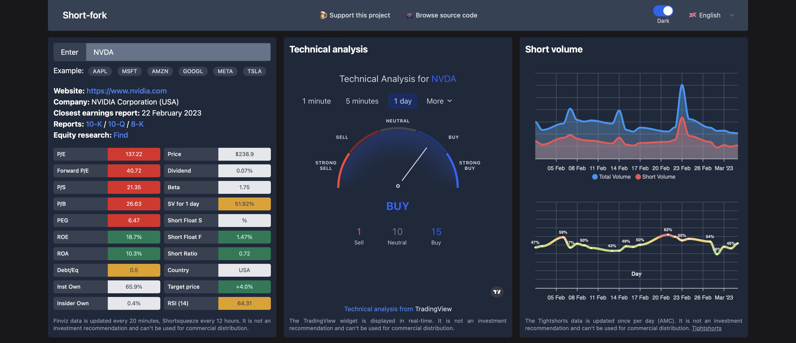
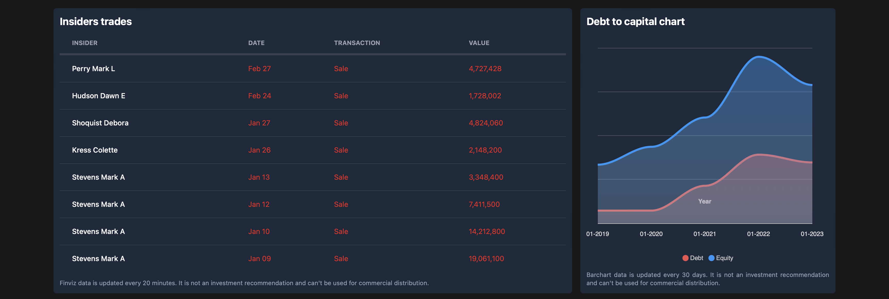

# Short Fork

Данный проект нацелен на агрегирование основных финансовых индикаторов американских акций, торгующихся на фондовой бирже. Основной упор приложение делает на данные о количестве шортовых позиций (Short Float и Short Volume).

Изначально делал веб приложение для себя, чтобы выводить самую нужную для меня информацию в читабельном виде на экране смартфона.

**[Перейти на short fork](https://short-fork.herokuapp.com)**

## Как пользоваться

Введите тикер компании (например **NVDA**) в поле ТИКЕР и нажмите Enter либо стрелочку слева. На данный момент приложение работает только с иностранными компаниями! Зелёным цветом отмечаются те показатели, по которым компания сейчас дёшева оценена, жёлтым справедливо и красным в переоценке (либо просто неадекватное значение).

После этого данные начнут собираться с нескольких источников, что может занять непродолжительное время.

На первом уровне отображаются основные мультипликаторы финансовых показателей, технический анализ от TradingView и график объёма шортовых позиций.

Далее располагаются данные по опционной торговле, ссылки на сторонние сервисы, консенсус аналитиков и график изменения выручки и прибыли компании за 5 лет.

Если вы не знаете, что означает каждый показатель - просто **кликните на него** и всплывёт подсказка!

На третьей срочке находятся данные по инсайдерским продажам и график отношения долга к капиталу компании.

И под конец - график TradingView с самыми популярными осцилляторами: RSI, STOCH, AO, BB.

## Источники данных

* [finviz.com](https://finviz.com/) - Название компании, сайт, цена, P/E, P/S, ROE, ROA, Debt/Eq, Short Float %, RSI, recom.
* [shortsqueeze.com](https://shortsqueeze.com/) - Short Float %. По данному параметру сразу два источника для информативности.
* [tightshorts.ru](https://tightshorts.ru/) - Short Volume %
* [tradingview.com](https://ru.tradingview.com/gopro/?share_your_love=eragonovich) - Виджет технического анализа и график цены
* [www.barchart.com](https://www.barchart.com/) - Долг к капиталу, Выручка и прибыль, Опционы, Мнение аналитиков
