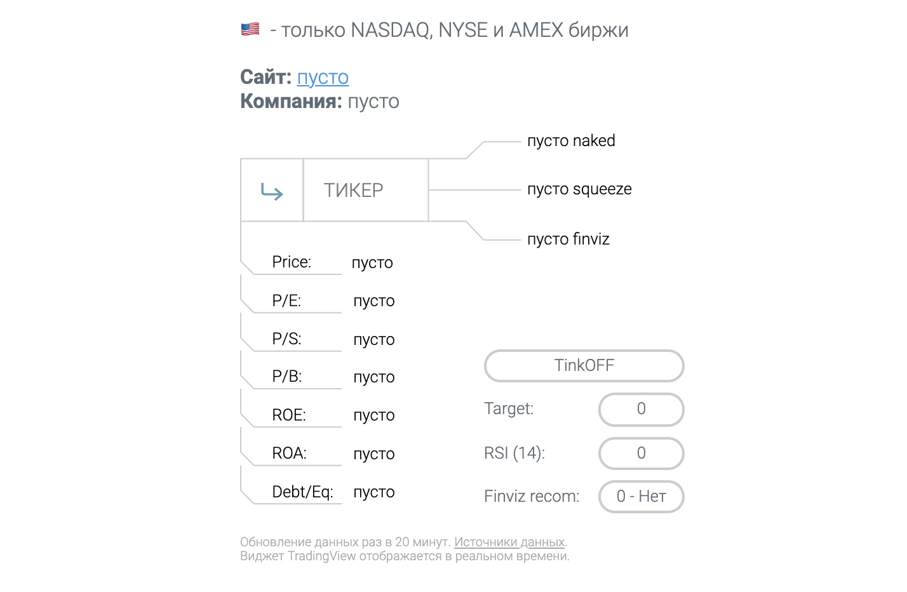
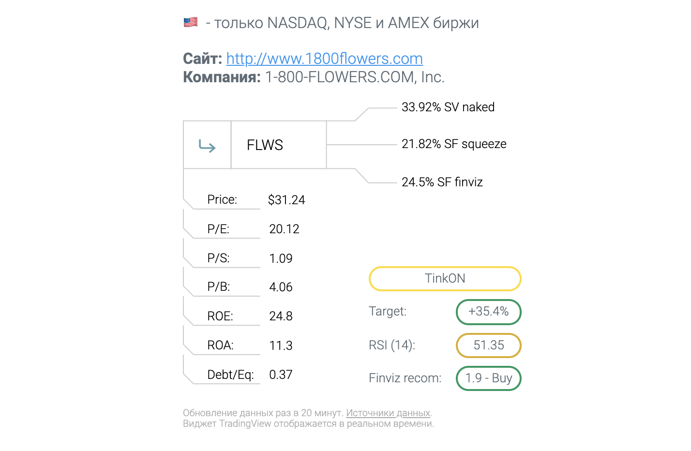
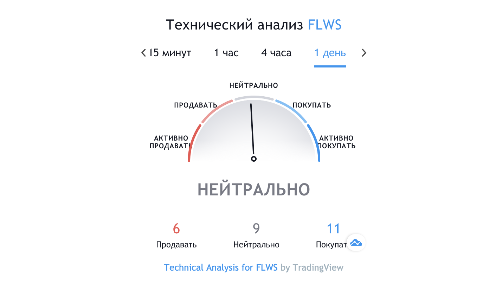

# Инструкция

Введите тикер компании (например **FLWS**) в поле ТИКЕР и нажмите Enter либо стрелочку слева. На данный момент приложение работает только с иностранными компаниями!

После этого данные начнут собираться с нескольких источников, что может занять непродолжительное время.

## Основной экран

### Обозначения
* **SV** - Short Volume - % шортовых позиций по сделкам за прошлый день
* **SF** - Short Float % - общий % акций в шорте
* **P/E** - отношение цены к прибыли
* **P/S** - отношение цены к выручке
* **ROE** - отдача от капитала
* **ROA** - отдача от всех активов
* **Debt/eq** - отношение долгов к капиталу
* **Target** - разница между текущей стоимостью акции и её средней целевой ценой от аналитиков.
* **RSI** - индекс относительной силы на дневных свечах с периодом 14. Если больше 70 - красная зона. Ниже 30 - зелёная.
* **Finviz recom** - средняя рекомендация к действию от аналитиков. 1-3 покупать, 3-4 держать, 4-5 продавать.

## Технический анализ
На втором экране представлен виджет краткого технического анализа от TardingView.

## Источники данных

* [finviz.com](https://finviz.com/) - Название компании, сайт, цена, P/E, P/S, ROE, ROA, Debt/Eq, Short Float %, RSI, recom.
* [shortsqueeze.com](https://shortsqueeze.com/) - Short Float %. По данному параметру сразу два источника для информативности.
* [nakedshortreport.com](https://nakedshortreport.com/) - Short Volume %
* [tradingview.com](https://tradingview.com/) - Виджет технического анализа

